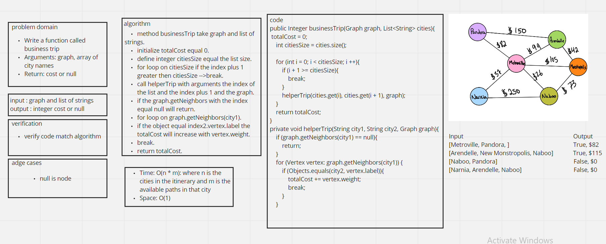

# Challenge Summary
<!-- Description of the challenge -->
Write a function called business trip
Arguments: graph, array of city names
Return: cost or null

## Whiteboard Process
<!-- Embedded whiteboard image -->


## Approach & Efficiency
<!-- What approach did you take? Why? What is the Big O space/time for this approach? -->
Time: O(n * m): where n is the cities in the itinerary and m is the available paths in that city
Space: O(1)

## Test

```
 @Test
    public void testBusinessTrip(){
        App app = new App();
        Graph citiesGraph = new Graph();
        citiesGraph.addVertex("Pandora");
        citiesGraph.addVertex("Arendelle");
        citiesGraph.addVertex("Metroville");
        citiesGraph.addVertex("Monstroplolis");
        citiesGraph.addVertex("Narnia");
        citiesGraph.addVertex("Naboo");

        citiesGraph.addEdge("Pandora","Arendelle",150);
        citiesGraph.addEdge("Arendelle","Metroville",99);
        citiesGraph.addEdge("Arendelle","Monstroplolis",42);
        citiesGraph.addEdge("Metroville","Narnia", 37);
        citiesGraph.addEdge("Metroville","Pandora", 82);
        citiesGraph.addEdge("Metroville","Naboo", 26);
        citiesGraph.addEdge("Monstroplolis","Metroville", 105);
        citiesGraph.addEdge("Monstroplolis","Naboo", 73);
        citiesGraph.addEdge("Naboo","Narnia", 250);

        List<String> citiesArr = new ArrayList<>();
        citiesArr.add("Metroville");
        citiesArr.add("Pandora");

        List<String> citiesArr2 = new ArrayList<>();
        citiesArr2.add("Arendelle");
        citiesArr2.add("Monstroplolis");
        citiesArr2.add("Naboo");


        List<String> citiesArr3 = new ArrayList<>();
        citiesArr3.add("Naboo");
        citiesArr3.add("Pandora");

        List<String> citiesArr4 = new ArrayList<>();

        assertEquals(82, app.businessTrip(citiesGraph, citiesArr));
        assertEquals(115, app.businessTrip(citiesGraph, citiesArr2));
        assertEquals(0, app.businessTrip(citiesGraph, citiesArr3));
        assertEquals(0, app.businessTrip(citiesGraph, citiesArr4));
    }
```