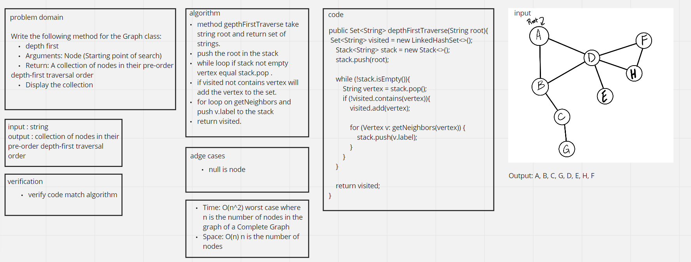

# Challenge Summary
<!-- Description of the challenge -->
Write the following method for the Graph class:
depth first
Arguments: Node (Starting point of search)
Return: A collection of nodes in their pre-order
depth-first traversal order
Display the collection
## Whiteboard Process
<!-- Embedded whiteboard image -->

## Approach & Efficiency
<!-- What approach did you take? Why? What is the Big O space/time for this approach? -->
Time: O(n^2) worst case where n is the number of nodes in the graph of a Complete Graph
Space: O(n) n is the number of nodes
## Test
```
    @Test Student
    public void testDepthFirstTraverse(){
        App app = new App();
        Graph graph = new Graph();
        graph.addVertex("A");
        graph.addVertex("B");
        graph.addVertex("C");
        graph.addVertex("D");
        graph.addVertex("E");
        graph.addVertex("F");
        graph.addVertex("G");
        graph.addVertex("H");
        graph.addEdge("A","D");
        graph.addEdge("A","B");
        graph.addEdge("B","D");
        graph.addEdge("B","C");
        graph.addEdge("C","G");
        graph.addEdge("D","F");
        graph.addEdge("D","H");
        graph.addEdge("D","E");
        graph.addEdge("F","H");
        List<String> list = new ArrayList<>();
        list.add("A");
        list.add("B");
        list.add("C");
        list.add("G");
        list.add("D");
        list.add("E");
        list.add("H");
        list.add("F");
        Set<String> result = graph.depthFirstTraverse("A");
        assertTrue(result.contains(list.get(0)));
        assertTrue(result.contains(list.get(1)));
        assertTrue(result.contains(list.get(2)));
        assertTrue(result.contains(list.get(3)));
        assertTrue(result.contains(list.get(4)));
        assertTrue(result.contains(list.get(5)));
        assertTrue(result.contains(list.get(6)));
        assertTrue(result.contains(list.get(7)));
    }
    ```