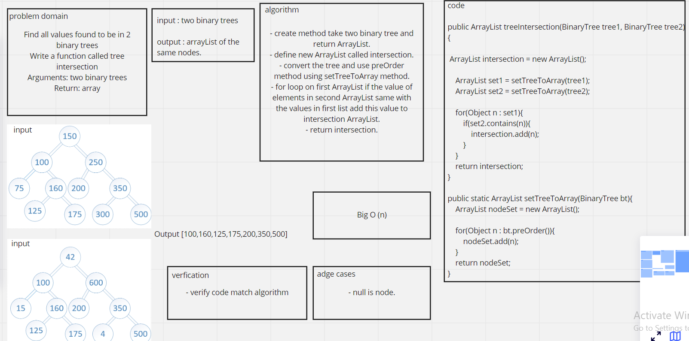

# Challenge Summary
<!-- Description of the challenge -->

Find all values found to be in 2 binary trees
Write a function called tree intersection
Arguments: two binary trees
Return: array


## Whiteboard Process
<!-- Embedded whiteboard image -->


## Approach & Efficiency
<!-- What approach did you take? Why? What is the Big O space/time for this approach? -->
Big O(n)


## Solution
<!-- Show how to run your code, and examples of it in action -->

```
BinaryTree<Integer> binaryTree = new BinaryTree();

        binaryTree.setRoot(new Node<>(1));
        binaryTree.getRoot().setLeft(new Node<>(5));
        binaryTree.getRoot().setRight(new Node<>(3));
        binaryTree.getRoot().getLeft().setLeft(new Node<>(4));

        BinaryTree<Integer> binaryTree2 = new BinaryTree();

        binaryTree2.setRoot(new Node<>(1));
        binaryTree2.getRoot().setLeft(new Node<>(5));
        binaryTree2.getRoot().setRight(new Node<>(2));
        binaryTree2.getRoot().getLeft().setLeft(new Node<>(4));

        System.out.println(salary.treeIntersection(binaryTree,binaryTree2));
```

result :
```
[1, 5, 4]
```

## Test

```
@Test
    public void inseartionTest(){
        BinaryTree<Integer> binaryTree = new BinaryTree();

        binaryTree.setRoot(new Node<>(1));
        binaryTree.getRoot().setLeft(new Node<>(5));
        binaryTree.getRoot().setRight(new Node<>(3));
        binaryTree.getRoot().getLeft().setLeft(new Node<>(4));

        BinaryTree<Integer> binaryTree2 = new BinaryTree();

        binaryTree2.setRoot(new Node<>(1));
        binaryTree2.getRoot().setLeft(new Node<>(5));
        binaryTree2.getRoot().setRight(new Node<>(2));
        binaryTree2.getRoot().getLeft().setLeft(new Node<>(4));

ArrayList test =  new ArrayList();
test.add(1);
test.add(5);
test.add(4);
        assertEquals(salary.treeIntersection(binaryTree,binaryTree2),test);
    }
```