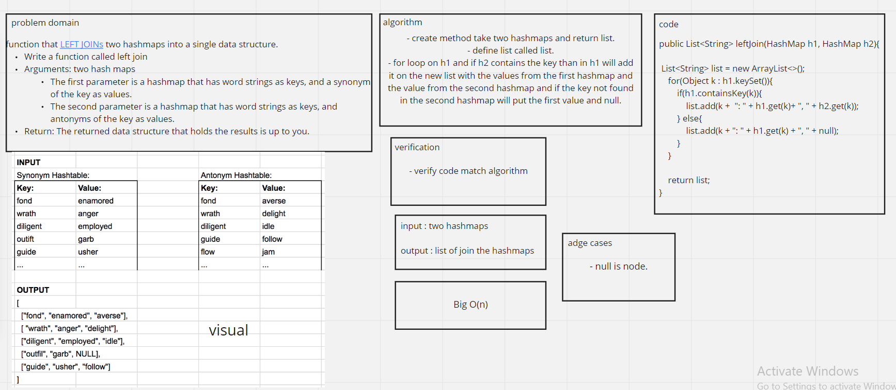

# Hashmap LEFT JOIN
<!-- Short summary or background information -->
Implement a simplified LEFT JOIN for 2 Hashmaps.


## Challenge
<!-- Description of the challenge -->

function that LEFT JOINs two hashmaps into a single data structure.

Write a function called left join
Arguments: two hash maps
The first parameter is a hashmap that has word strings as keys, and a synonym of the key as values.
The second parameter is a hashmap that has word strings as keys, and antonyms of the key as values.
Return: The returned data structure that holds the results is up to you.


## Approach & Efficiency
<!-- What approach did you take? Why? What is the Big O space/time for this approach? -->

Big O(n)
## Solution
<!-- Embedded whiteboard image -->


## Test

```
@Test
    public void test_leftWithAllJoins(){
        HashMap h1 = new HashMap();
        h1.put("fond", "enamored");
        h1.put("wrath", "anger");
        h1.put("flow", "jam");

        HashMap h2 = new HashMap();
        h2.put("fond", "averse");
        h2.put("wrath", "delight");
        h2.put("flow", "test");

        List<String> list = new ArrayList<>();
        list.add("wrath: anger, delight");
        list.add("flow: jam, test");
        list.add("fond: enamored, averse");

        assertEquals("[wrath: anger, delight, flow: jam, test, fond: enamored, averse]" , salary.leftJoin(h1, h2).toString());
    }

    @Test
    public void test_leftWithSomeJoins(){
        HashMap h1 = new HashMap();
        h1.put("fond", "enamored"); //
        h1.put("wrath", "anger"); //
        h1.put("diligent", "employed");
        h1.put("outfit", "garb");
        h1.put("guide", "usher");

        HashMap h2 = new HashMap();
        h2.put("fond", "averse");
        h2.put("wrath", "delight");
        h2.put("flow", "jam");

        List<String> list = new ArrayList<>();
        list.add("diligent: employed, null");
        list.add("outfit: garb, null");
        list.add("wrath: anger, delight");
        list.add("guide: usher, null");
        list.add("fond: enamored, averse");

        assertEquals("[diligent: employed, null, outfit: garb, null, wrath: anger, delight, guide: usher, null, fond: enamored, averse]", salary.leftJoin(h1, h2).toString());
    }

    @Test
    public void test_leftWithEmptySecondHashMap(){
        HashMap h1 = new HashMap();
        h1.put("fond", "enamored");
        h1.put("wrath", "anger");
        h1.put("diligent", "employed");
        h1.put("outfit", "garb");
        h1.put("guide", "usher");

        HashMap h2 = new HashMap();

        List<String> list = new ArrayList<>();
        list.add("diligent: employed, null");
        list.add("outfit: garb, null");
        list.add("wrath: anger, null");
        list.add("guide: usher, null");
        list.add("fond: enamored, null");

        assertEquals("[diligent: employed, null, outfit: garb, null, wrath: anger, null, guide: usher, null, fond: enamored, null]", salary.leftJoin(h1, h2).toString());

    }

    @Test
    public void test_leftBothEmptyHashMap(){
        HashMap h1 = new HashMap();
        HashMap h2 = new HashMap();

        List<String> list = new ArrayList<>();

        assertEquals("[]", salary.leftJoin(h1, h2).toString());

    }
```