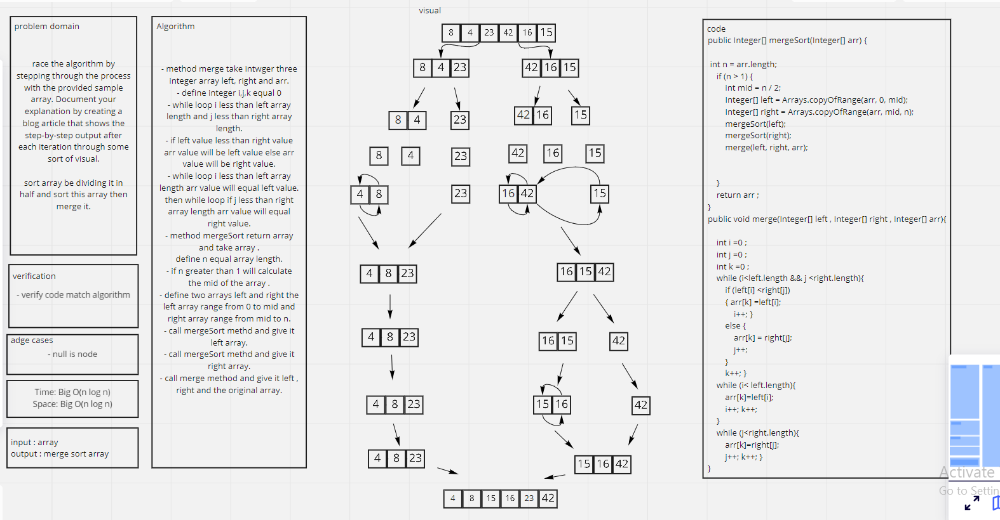

# Challenge Summary
<!-- Description of the challenge -->

sort array be dividing it in half and sort this array then merge it.

```
ALGORITHM Mergesort(arr)
    DECLARE n <-- arr.length

    if n > 1
      DECLARE mid <-- n/2
      DECLARE left <-- arr[0...mid]
      DECLARE right <-- arr[mid...n]
      // sort the left side
      Mergesort(left)
      // sort the right side
      Mergesort(right)
      // merge the sorted left and right sides together
      Merge(left, right, arr)

ALGORITHM Merge(left, right, arr)
    DECLARE i <-- 0
    DECLARE j <-- 0
    DECLARE k <-- 0

    while i < left.length && j < right.length
        if left[i] <= right[j]
            arr[k] <-- left[i]
            i <-- i + 1
        else
            arr[k] <-- right[j]
            j <-- j + 1

        k <-- k + 1

    if i = left.length
       set remaining entries in arr to remaining values in right
    else
       set remaining entries in arr to remaining values in left

Sample Arrays
[8,4,23,42,16,15]
```

## Whiteboard Process
<!-- Embedded whiteboard image -->


## Approach & Efficiency
<!-- What approach did you take? Why? What is the Big O space/time for this approach? -->
Big O(n log n)

## Solution
<!-- Show how to run your code, and examples of it in action -->

```
MargeSort mergeSort= new MargeSort();
        System.out.println(Arrays.toString(mergeSort.mergeSort(array)));
```
result:
```
[4, 8, 15, 16, 23, 42]
```

## Test

```
@Test
    public void testMergeSort() {
        MargeSort mergeSort= new MargeSort();
        assertArrayEquals(new Integer[]{5, 10, 15, 25, 30}, mergeSort.mergeSort(integerArr));
    }
```