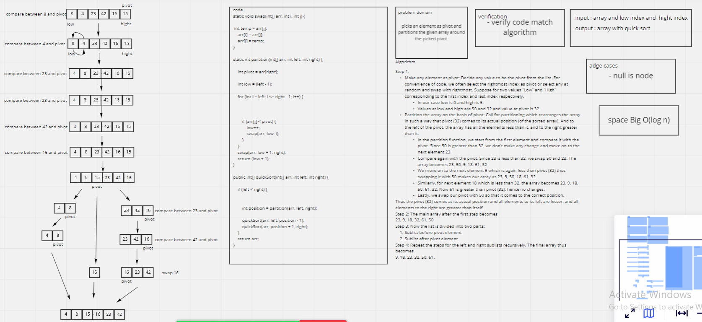

## Whiteboard Process
<!-- Embedded whiteboard image -->



## Approach & Efficiency
<!-- What approach did you take? Why? What is the Big O space/time for this approach? -->

Space Big O(log n)

## Solution
<!-- Show how to run your code, and examples of it in action -->

```
QuickSort quickSort= new QuickSort();
int arr[] = {8,4,23,42,16,15};
System.out.println(Arrays.toString(quickSort.quickSort(arr, 0, arr.length - 1)));
```
result:
```
[4, 8, 15, 16, 23, 42]
```

## Test
```
 @Test void quickSortTest(){

        int arr[] = {8,4,23,42,16,15};
        QuickSort quickSort=new QuickSort();
        quickSort.quickSort(arr,0,arr.length-1);

        String res= Arrays.toString(arr);
        assertEquals("[4, 8, 15, 16, 23, 42]",res); }

    @Test void newQuickTest(){

        int arr[] = {8,4,23,1,42,16,15};
        QuickSort quickSort=new QuickSort();
        quickSort.quickSort(arr,0,arr.length-1);

        String res= Arrays.toString(arr); assertEquals("[1, 4, 8, 15, 16, 23, 42]",res);
    }
```