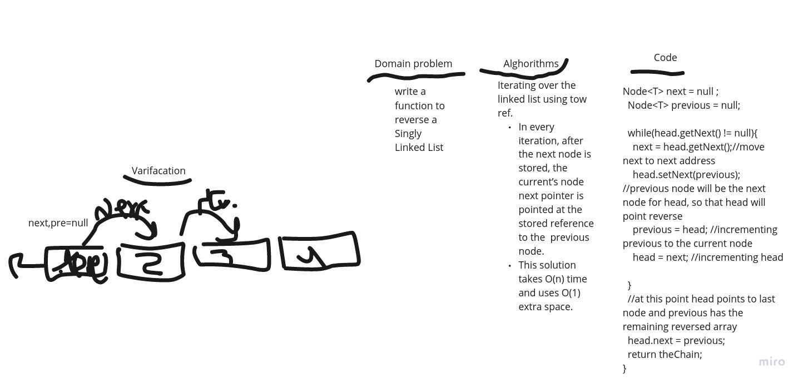

# Reverse Function
## it allow you to send a Singly-Linked-List and return to you the same linked list but reversed 

### it cost O(n) time and O(1) space

# palandrome
it a boolean function will takes a linkedlist turn it to array and  compare if the list from the right equal the list from left turn **true** else return *false*