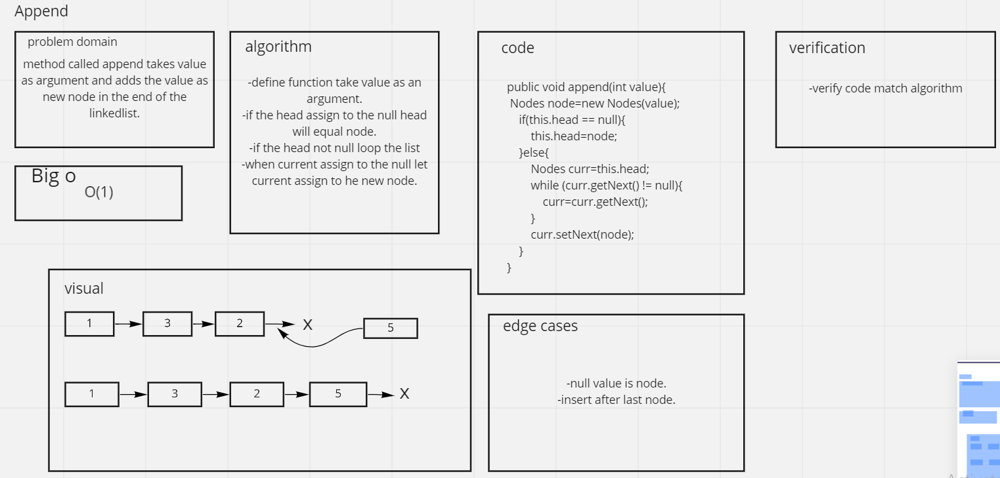
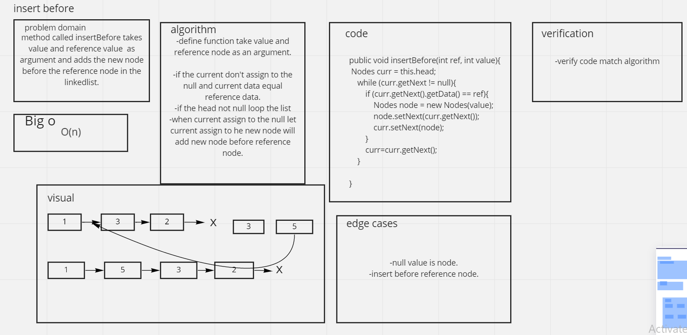
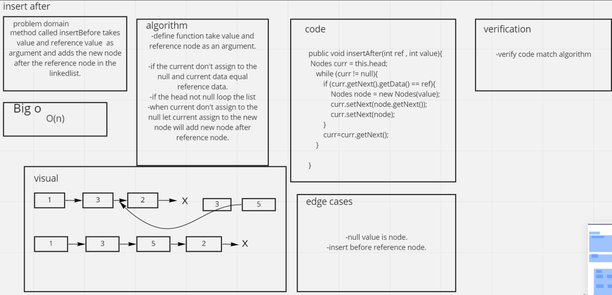

# linked list 
## appednd Method 
these allow you to add to your linked list 

## insertBefore
### thats take a newnode and the value of the data thats you need to isert this newnode before

## insertAfter
### thats take a newnode and the value of the data thats you need to isert this newnode after

## kthFromEnd
### return the node at specific index vice-versa