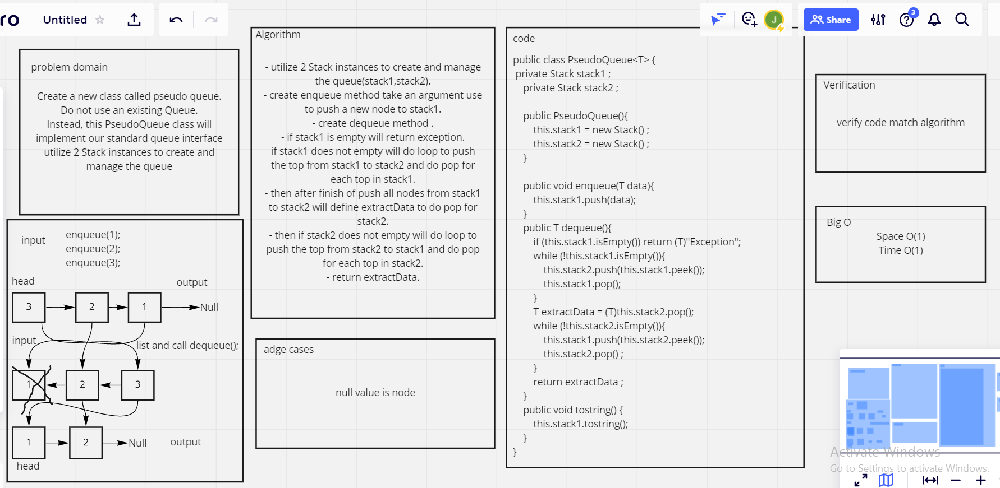

Approach & Efficiency
utilize 2 Stack instances to create and manage the queue(stack1,stack2).
create enqueue method take an argument use to push a new node to stack1.
create dequeue method .
if stack1 is empty will return exception. if stack1 does not empty will do loop to push the top from stack1 to stack2 and do pop for each top in stack1.
then after finish of push all nodes from stack1 to stack2 will define extractData to do pop for stack2.
then if stack2 does not empty will do loop to push the top from stack2 to stack1 and do pop for each top in stack2.
return extractData.
Solution
enqueue:
PseudoQueue sodo = new PseudoQueue();
sodo.enqueue(1);
sodo.enqueue(2);
sodo.enqueue(3);
sodo.tostring();
Result: {3} ->{2} ->{1} ->Null
dequeue:
sodo.dequeue();
Result: {3} ->{2} ->Null

/////////////////////////////
#stack-queue-animal-shelter
Challenge Summary
Create a class called AnimalShelter which holds only dogs and cats. The shelter operates using a first-in, first-out approach.
Whiteboard Process
Approach & Efficiency
space: O(1) time: O(1)
Solution
enqueue:
````
Animal animal = new Animal("cat");
Animal animal1 = new Animal("dog");
Animal animal2 = new Animal("monkey");
animal.enqueue(animal.getKind()); animal.enqueue(animal1.getKind()); animal.enqueue(animal2.getKind());
Result: {cat} ->{dog} ->Null
dequeue:
System.out.println( animal.deQueue("dog"));
Result: {cat} ->Null
Test:
@Test Student public void testEnQueue(){
Animal animal = new Animal("cat");
animal.enqueue(animal.getKind());
Assertions.assertEquals("cat",animal.getKind());
}
@Test Student public void testdeQueue(){
Animal animal = new Animal("dog");
Assertions.assertEquals("pref is dog",animal.deQueue("dog"));
}