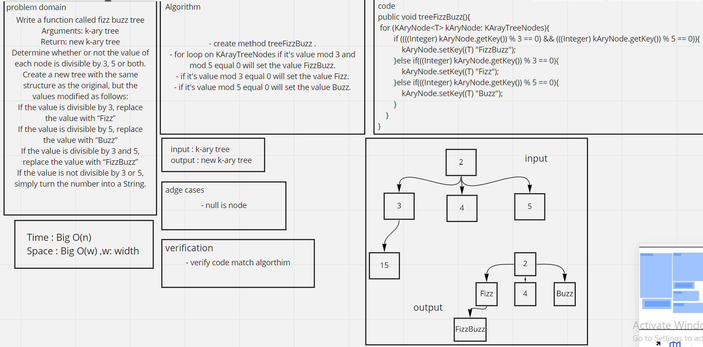

# Challenge Summary
<!-- Description of the challenge -->
Write a function called fizz buzz tree
Arguments: k-ary tree
Return: new k-ary tree
Determine whether or not the value of each node is divisible by 3, 5 or both. Create a new tree with the same structure as the original, but the values modified as follows:
If the value is divisible by 3, replace the value with "Fizz"
If the value is divisible by 5, replace the value with "Buzz"
If the value is divisible by 3 and 5, replace the value with "FizzBuzz"
If the value is not divisible by 3 or 5, simply turn the number into a String
## Whiteboard Process
<!-- Embedded whiteboard image -->

## Approach & Efficiency
<!-- What approach did you take? Why? What is the Big O space/time for this approach? -->
Time Big O(n)
Space Big O(w)
## Solution
<!-- Show how to run your code, and examples of it in action -->
```aidl

 List<Integer> list = new ArrayList<>();
        list.add(10);
        list.add(20);
        list.add(3);
        list.add(40);
        list.add(50);
        list.add(60);
        list.add(70);//
        list.add(8);
        list.add(90);
        list.add(30);
        KAryTree<Integer> kAryTree = new KAryTree<>(list, 3);
        kAryTree.postorder(kAryTree.getRoot());
        System.out.println();
        kAryTree.treeFizzBuzz();
        kAryTree.postorder(kAryTree.getRoot());
```
> the result was --> Buzz FizzBuzz Buzz Buzz 8 FizzBuzz FizzBuzz Fizz Buzz Buzz