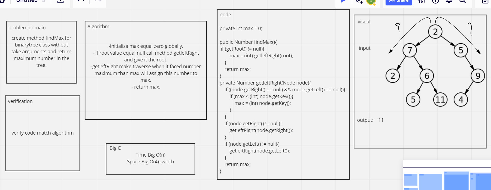

# Trees
<!-- Short summary or background information -->
A tree whose elements have at most 2 children is called a binary tree. Since each element in a binary tree can have only 2 children,
we typically name them the left and right child.
- InOrder: left root right.
- postOrder: left right root.
- preOrder: root left right.

## Challenge
<!-- Description of the challenge -->
#### Create a Node class that has properties for the value stored in the node, the left child node, and the right child node.
#### Create a Binary Tree class
Define a method for each of the depth first traversals:
- pre order
- in order
- post order
  which returns an array of the values, ordered appropriately.
#### Create a Binary Search Tree class
This class sub-class of the Binary Tree Class
- Add method has:
  Arguments: value
  Return: nothing
  Adds a new node with that value in the correct location in the binary search tree.
- Contains method has:
  Argument: value
  Returns: boolean indicating whether or not the value is in the tree at least once.
## Approach & Efficiency
<!-- What approach did you take? Why? What is the Big O space/time for this approach? -->
space Big O(width)
Time  Big O(n)
## API
<!-- Description of each method publicly available in each of your trees -->
I used ArrayList.
////////////////////////
# Challenge Summary
<!-- Description of the challenge -->
create method findMax for binarytree class without take arguments and return maximum number in the tree.
## Whiteboard Process
<!-- Embedded whiteboard image -->

## Approach & Efficiency
<!-- What approach did you take? Why? What is the Big O space/time for this approach? -->
Time Big O(n)
Space Big O(4)=width
## Solution
<!-- Show how to run your code, and examples of it in action -->
BineryTree tree = new BineryTree();
tree.setRoot(new Node(2));
tree.getRoot().setLeft(new Node(7));
tree.getRoot().setRight(new Node(5));
tree.getRoot().getLeft().setRight(new Node(6));
tree.getRoot().getLeft().getRight().setLeft( new Node(1));
tree.getRoot().getLeft().getRight().setRight(new Node(11));
tree.getRoot().getRight().setRight(new Node(9));
tree.getRoot().getRight().getRight().setLeft(new Node(4));
System.out.println("Maximum element is "+ tree.findMax());
Solution: 11