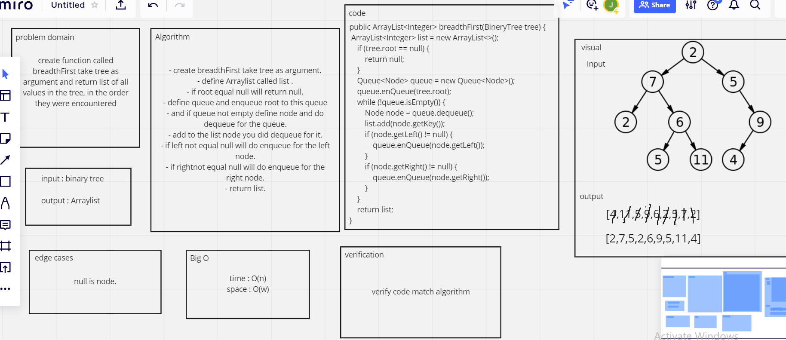

# Challenge Summary
<!-- Description of the challenge -->
create function called breadthFirst take tree as argument and return list of all values in the tree, in the order they were encountered

## Whiteboard Process
<!-- Embedded whiteboard image -->

## Approach & Efficiency
<!-- What approach did you take? Why? What is the Big O space/time for this approach? -->
Time Big O(n)
Space Big O(w)

## Solution
<!-- Show how to run your code, and examples of it in action -->

BineryTree tree = new BineryTree();
tree.setRoot(new Node<T>(2));
tree.getRoot().setLeft(new Node<T>(7));
tree.getRoot().setRight(new Node<T>(5));
tree.getRoot().getLeft().setRight(new Node<T>(6));
tree.getRoot().getLeft().getRight().setLeft( new Node<T>(1));
tree.getRoot().getLeft().getRight().setRight(new Node<T>(11));
tree.getRoot().getRight().setRight(new Node<T>(9));
tree.getRoot().getRight().getRight().setLeft(new Node<T>(4));

System.out.println(tree.breadthFirst(tree));

Solution: [2, 7, 5, 6, 9, 1, 11, 4]